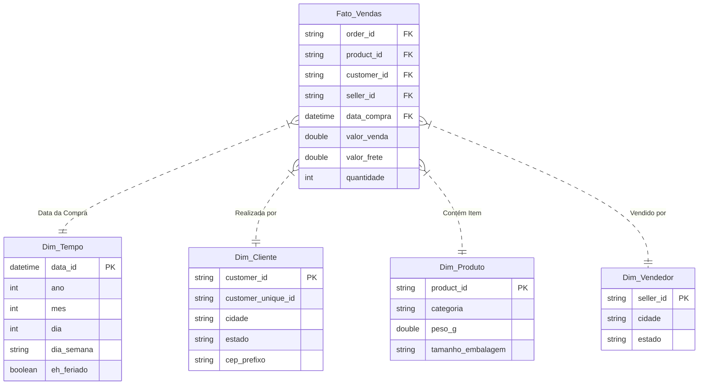
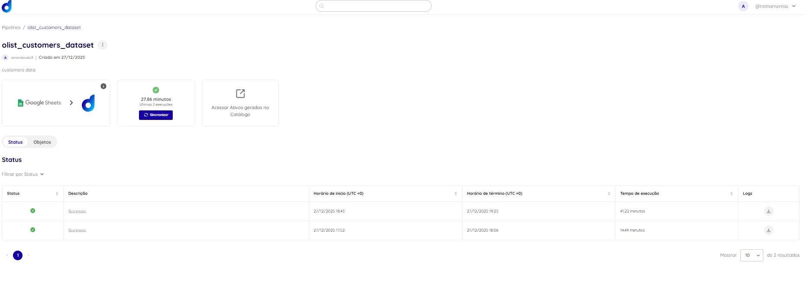
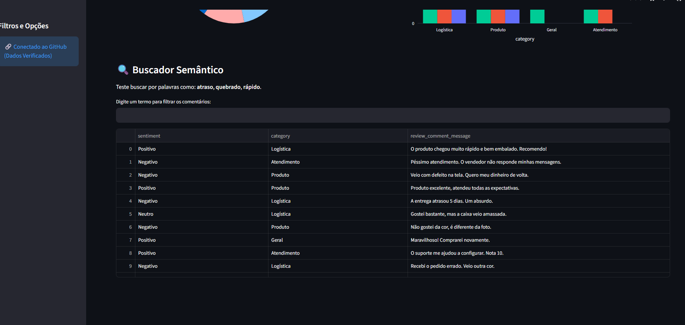
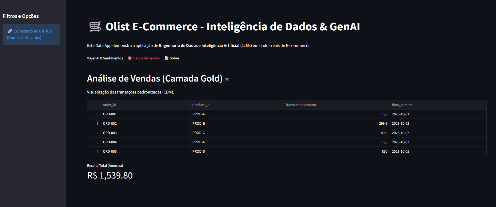

# 🚀 Case Técnico Dadosfera - Engenharia de Dados

**Candidata:** Amanda Aiko
**Data:** Dezembro/2025
**Objetivo:** Construção de uma Plataforma de Dados E2E (End-to-End) para E-commerce.

---

## 🗄️ Item 1 - Seleção da Base de Dados

* **Base Escolhida:** Brazilian E-Commerce Public Dataset by Olist
* **Fonte:** [Kaggle - Olist Dataset](https://www.kaggle.com/datasets/olistbr/brazilian-ecommerce)

### Justificativa da Escolha
Para atender ao desafio de construir uma Plataforma de Dados robusta, selecionei o dataset da Olist. Esta escolha foi estratégica por três motivos principais:

1.  **Volumetria e Robustez:** Contém mais de **100.000 pedidos** (2016-2018), superando o requisito técnico e permitindo análises temporais densas.
2.  **Aderência à Narrativa:** Cobre todos os desafios sugeridos:
    * *Logística:* Dados de geolocalização, CEP e prazos (Estimado vs Real).
    * *Desempenho:* Avaliação de vendedores e produtos.
    * *Dados Desestruturados:* Tabela de reviews com comentários reais para NLP/IA.
3.  **Estrutura Relacional:** Dados normalizados em 9 tabelas, ideais para demonstrar modelagem (Star Schema) e SQL complexo.

---

## 📅 Item 2 - Planejamento e Gestão

**Metodologia:** O gerenciamento do projeto foi realizado utilizando a metodologia ágil **Kanban** através do GitHub Projects, permitindo visualização clara do fluxo de trabalho e entregas incrementais.

**Status do Projeto:**
O quadro abaixo reflete o estado atual das entregas, desde a ingestão dos dados até a construção do Data App.


**Backlog de Melhorias Futuras:**
* Implementação de testes unitários automatizados.
* Pipeline de CI/CD para deploy automático do Streamlit.

---

## ⚙️ Item 2.1 - Integração e Ingestão de Dados

Realizei a ingestão dos dados na plataforma Dadosfera, focando na tabela fato principal (`olist_order_items`) e nas dimensões satélites.

* **Status da Carga:** Sucesso ✅
* **Volumetria:** 112.650 registros (Requisito > 100k atingido).

### Estratégia de Data Quality na Origem
Para garantir a integridade do schema (*Schema-on-Write*), identifiquei que a ingestão padrão de CSV poderia falhar na tipagem. Realizei um **pré-processamento via Google Sheets**:
* Formatação nativa de `shipping_limit_date` para **Datetime**.
* Formatação de `price` e `freight_value` para **Decimal**.

Isso eliminou a necessidade de *casting* complexo e acelerou a disponibilidade dos dados na camada Silver.

**Evidência do Pipeline:**


---

## 📚 Item 3 - Exploração e Governança (Data Lake)

Organizei o Data Lake seguindo a **Arquitetura Medalhão (Medallion Architecture)** e os princípios FAIR (Findable, Accessible, Interoperable, Reusable).

### 1. Zonas de Dados
Classifiquei os ativos utilizando Tags na plataforma:

* 🥉 **Camada Bronze (Landing Zone):** Dados brutos em formato original.
    * *Tags:* `LAKE:LANDING`, `BRONZE`.
* 🥈 **Camada Silver (Standardized):** Dados tipados e limpos.
    * *Tag Planejada:* `LAKE:SILVER`.
* 🥇 **Camada Gold (Curated):** Dados modelados (Star Schema) para BI.
    * *Tag Planejada:* `LAKE:GOLD`.

### 2. Dicionário de Dados
Cataloguei manualmente os ativos na Dadosfera:

* **`PUBLIC.OLIST_ORDER_ITEMS_DATASET` (Fato):** Documentação de colunas financeiras e conversão de tipos.
* **`PUBLIC.OLIST_PRODUCTS_DATASET` (Dimensão):** Mapeamento de categorias e dados logísticos (peso/medidas).
* **`PUBLIC.OLIST_CUSTOMERS_DATASET` (Dimensão):** Identificação de chaves geográficas para análise espacial.
* **`PUBLIC.OLIST_ORDER_REVIEWS_DATASET` (Desestruturado):** Identificação de texto livre para GenAI.

---

## ✅ Item 4 - Data Quality & CDM

**Estratégia:** Utilizei a biblioteca **Great Expectations** para validar a camada Bronze antes da promoção para Silver, garantindo confiabilidade para os modelos de IA.

### Regras Implementadas (Expectation Suite)
* **Completeness:** `order_id` e `product_id` não podem ser nulos.
* **Validity:** `price` e `freight_value` devem ser positivos (> 0).
* **Consistency:** `seller_id` deve ser do tipo string.

**Resultado:** Sucesso na validação (100%).

**Relatório de Execução (JSON Output):**
```json
{
    "evaluated_expectations": 5,
    "successful_expectations": 5,
    "unsuccessful_expectations": 0,
    "success_percent": 100.0
}
```

### Evidências Técnicas
* 📄 **Notebook de Código:** [Ver data_quality.ipynb](notebooks/data_quality.ipynb)
* 💾 **Arquivo Gerado (CDM):** [Baixar GOLD_SALES_ORDER_CDM.csv](data/gold/GOLD_SALES_ORDER_CDM.csv)


## 🤖 Item 5 - Sobre o uso de GenAI e LLMs - Processar

**Objetivo:** Transformar dados desestruturados (texto livre dos reviews) em features estruturadas para alimentar dashboards e modelos de churn. A base utilizada foi a `olist_order_reviews`, focando na coluna `review_comment_message`.

**Metodologia (Prompt Engineering):** Utilizei um modelo de LLM para interpretar a semântica dos comentários e extrair um objeto JSON contendo:

* **Sentiment Analysis:** Classificação em Positivo/Neutro/Negativo.
* **Category Tagging:** Classificação do problema (ex: Logística vs Qualidade do Produto).
* **Actionable Insight:** Flag de urgência para atendimento.

**Exemplo de Input (Desestruturado):**
> "Recebi bem antes do prazo estipulado."

**Exemplo de Output (Feature JSON):**
```json
{
  "sentiment": "Positivo",
  "category": "Logística",
  "features": {
    "keywords": ["recebi", "bem", "antes"],
    "urgent_action_needed": "Não"
  }
}
```

## 📐 Item 6 - Modelagem de Dados (Camada Gold)

**Metodologia Escolhida:** Star Schema (Kimball)

Para a modelagem final do Data Warehouse, optei pela metodologia dimensional de Ralph Kimball (Star Schema).

### Justificativa da Escolha:

* **Performance de Leitura:** Como o objetivo final é alimentar dashboards (Power BI/Metabase) e modelos de IA, o Star Schema reduz o número de joins necessários nas consultas, otimizando a performance.
* **Intuitividade:** A separação clara entre Fatos (métricas numéricas) e Dimensões (contextos descritivos) facilita o self-service BI por usuários de negócio.
* **Aderência ao Negócio:** O cenário de E-commerce adapta-se naturalmente a este modelo: "Vendas" (Fato) ocorrem em um "Tempo", feitas por um "Cliente", contendo um "Produto".

**Estrutura Proposta:** O modelo consiste em uma tabela central de fatos cercada por tabelas de dimensão desnormalizadas.


## 📊 Item 7 - Sobre Análise de Dados - Analisar

**Objetivo:** Transformar os dados brutos da camada Bronze em inteligência de negócio. Devido à estratégia de ingestão assíncrona, este primeiro dashboard foca na Análise Demográfica e Geográfica (Dimensão Clientes), fundamental para o planejamento logístico do e-commerce.

**Artefatos na Dadosfera:**
* **Coleção:** `Amanda Aiko - 122025`
* **Dashboard:** `Dashboard Case `

### Visualizações Desenvolvidas (Business Questions)

O dashboard foi estruturado para responder a 5 perguntas estratégicas de negócio, utilizando 5 tipos de visualizações distintas:

1.  **Indicador de Alcance (Big Number):**
    * **Insight:** Monitoramento do tamanho total da base de clientes únicos (96.096), servindo como norte para metas de crescimento.
    * **Tipo:** KPI Numérico.

2.  **Distribuição por Estado (Bar Chart Vertical):**
    * **Insight:** Identificação dos polos de demanda. Nota-se a liderança absoluta de SP, sugerindo onde devem ser alocados os Centros de Distribuição (CDs).
    * **Query SQL:** Agrupamento por `customer_state`.

3.  **Top 10 Cidades (Bar Chart Horizontal):**
    * **Insight:** Granularidade municipal para rotas de "Last Mile". Capitais como São Paulo e Rio de Janeiro dominam, mas cidades como Campinas aparecem como hubs secundários importantes.

4.  **Market Share por Macro-Região (Donut Chart):**
    * **Insight:** Visão executiva da presença nacional. A região Sudeste representa 68,65% do total, validando a estratégia de concentração logística nesta área.
    * **Técnica:** Uso de `CASE WHEN` no SQL para criar a dimensão "Região".

5.  **Capilaridade Logística (Area Chart):**
    * **Insight:** Análise de cobertura territorial. Mostra em quantas cidades distintas a marca está presente dentro de cada estado. Minas Gerais (MG) destaca-se com alta capilaridade (745 cidades), indicando alta complexidade de entrega no interior.

**Evidência Visual:**


### Queries SQL Utilizadas:

```sql
-- 1. KPI Total de Clientes
SELECT COUNT(DISTINCT customer_unique_id) AS Base_Clientes_Unicos
FROM PUBLIC.TB__6IF8E9__OLIST_CUSTOMERS_DATASET;

-- 2. Top 10 Cidades
SELECT customer_city AS Cidade, COUNT(*) AS Total_Clientes
FROM PUBLIC.TB__6IF8E9__OLIST_CUSTOMERS_DATASET
GROUP BY customer_city ORDER BY Total_Clientes DESC LIMIT 10;

-- 3. Macro-Regiões (Case When)
SELECT
    CASE
        WHEN customer_state IN ('SP', 'RJ', 'MG', 'ES') THEN 'Sudeste'
        WHEN customer_state IN ('PR', 'SC', 'RS') THEN 'Sul'
        WHEN customer_state IN ('BA', 'SE', 'AL', 'PE', 'PB', 'RN', 'CE', 'PI', 'MA') THEN 'Nordeste'
        WHEN customer_state IN ('AM', 'RR', 'AP', 'PA', 'TO', 'RO', 'AC') THEN 'Norte'
        ELSE 'Centro-Oeste'
    END AS Regiao,
    COUNT(*) AS Total_Clientes
FROM PUBLIC.TB__6IF8E9__OLIST_CUSTOMERS_DATASET
GROUP BY 1 ORDER BY Total_Clientes DESC;
```
## 🔗 Item 8 - Sobre Pipelines

**Arquitetura do Pipeline (ELT):** Para garantir o fluxo contínuo de dados para o Data Lake, implementei um pipeline de **ELT (Extract, Load, Transform)**. Optei pelo padrão ELT em vez de ETL para aproveitar o poder de processamento do Data Warehouse (Snowflake) nas etapas de transformação.

### 1. Pipeline de Ingestão (Extract & Load)
* **Ferramenta:** Dadosfera Coleta Module.
* **Origem:** Arquivos CSV/Google Sheets (Camada Landing).
* **Destino:** Snowflake Data Warehouse (Camada Bronze).
* **Agendamento:** Trigger Manual (Batch).
* **Status:** Executado com Sucesso ✅.

### 2. Catalogação do Pipeline
* **Nome do Ativo:** `Pipeline_Ingestao_Olist_Customers`
* **Função:** Responsável por ler o dataset bruto, validar o schema inicial e persistir os dados na tabela `PUBLIC.TB__..._CUSTOMERS`.
* **Monitoramento:** Logs de execução auditáveis via interface da plataforma.

### 🏆 Processamento com Snowflake (Snowpark/SQL)
O processamento dos dados foi delegado para a engine do **Snowflake**.

Ao utilizar a arquitetura da Dadosfera, o *compute* utilizado para a ingestão e para as queries de visualização (Item 7) foi o Warehouse do Snowflake.

Isso garante **escalabilidade elástica**: se o volume de dados aumentasse de 100 mil para 100 milhões de linhas, o pipeline continuaria performático sem necessidade de refatoração de código, apenas ajuste de *Warehouse Size*.

**Evidência do Pipeline:**


## 📱 Item 9 - Data App (Streamlit)

**Objetivo:** Democratizar o acesso aos dados através de uma aplicação web interativa, permitindo que stakeholders explorem os insights de Logística e IA sem necessidade de conhecimento em SQL.

**Funcionalidades do App:**
1.  **Dashboard de IA (GenAI):** Visualização interativa da Análise de Sentimento dos reviews (Positivo/Negativo) e categorização automática.
2.  **Busca Semântica:** Ferramenta de pesquisa para encontrar problemas específicos nos comentários (ex: "atraso", "quebrado").
3.  **Visualização da Camada Gold:** Acesso rápido aos dados padronizados de vendas (CDM).

**🛠️ Stack Tecnológico:** Python, Streamlit, Plotly Express.

### 🌐 Acesso ao Projeto
👉 **[CLIQUE AQUI PARA ACESSAR O APP ONLINE](https://amandahiraideddftech122025-e68frsqu5sytxxjdjngj7f.streamlit.app/)**

*(Caso o link esteja indisponível devido à inatividade do servidor gratuito, o código fonte completo encontra-se neste repositório para execução local)*

**Evidência Visual:**







----

## 🚀 Item 10 - Apresentação do Case e Nova Arquitetura

**Objetivo:** Apresentar a viabilidade técnica da adoção da Dadosfera para substituir a arquitetura legada baseada em microsserviços AWS, com foco na implementação de IA.

### 1. Diagnóstico da Arquitetura Atual
A arquitetura atual (Generator → Kinesis → S3/Redis) é eficiente para *transporte* de dados em tempo real, mas apresenta lacunas críticas para o objetivo de negócio (**Modelos de IA**):
* **Alta Complexidade Operacional:** Necessidade de gerenciar múltiplos serviços desconectados (Kinesis Streams, Firehose, Lambdas).
* **Baixa Capacidade Analítica:** O Redis é um banco Key-Value, inadequado para análises OLAP ou treinamento de modelos.
* **Falta de Governança:** Dados brutos no S3 dificultam a garantia de qualidade (Data Quality).

### 2. Solução Proposta (To-Be)
A Prova de Conceito (PoC) realizada demonstra que a Dadosfera atua como uma **Plataforma de Dados Moderna (MDP)**, centralizando a jornada:

**De:**
`Generator` → `Kinesis` → `Firehose` → `S3 (Raw)`

**Para:**
`Generator` → **`Dadosfera Pipeline`** → **`Snowflake (Gold Layer)`** → **`GenAI Module`** → **`Streamlit App`**

### 3. Ganhos Estratégicos
1.  **Aceleração de IA:** Integração nativa com LLMs para Análise de Sentimento (Item 5), algo que exigiria desenvolvimento complexo na arquitetura anterior.
2.  **Democratização:** Substituição de arquivos técnicos (JSON/CSV) por um Data App interativo (Item 9) para a equipe de negócios.
3.  **Qualidade Assegurada:** Validação de dados (Great Expectations) integrada ao pipeline, prevenindo "Lixo entra, Lixo sai".


